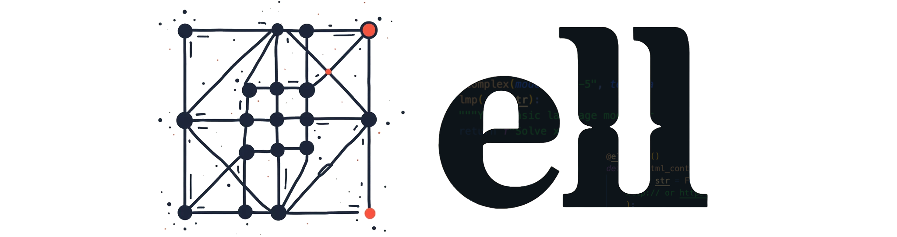
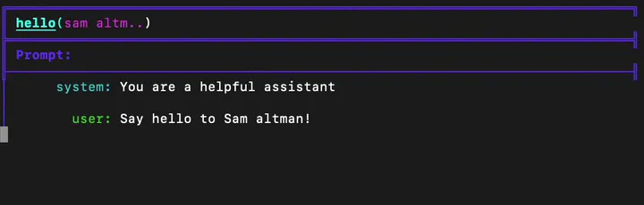
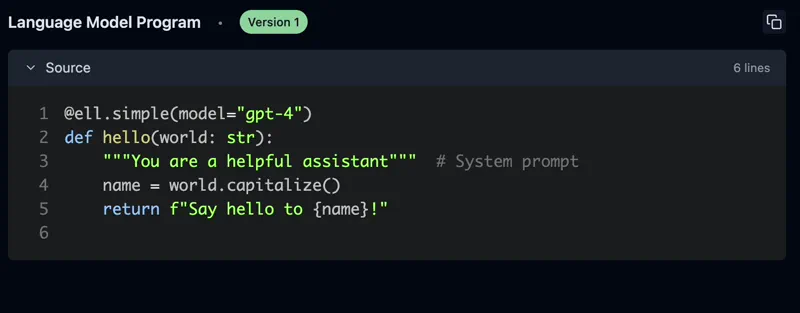
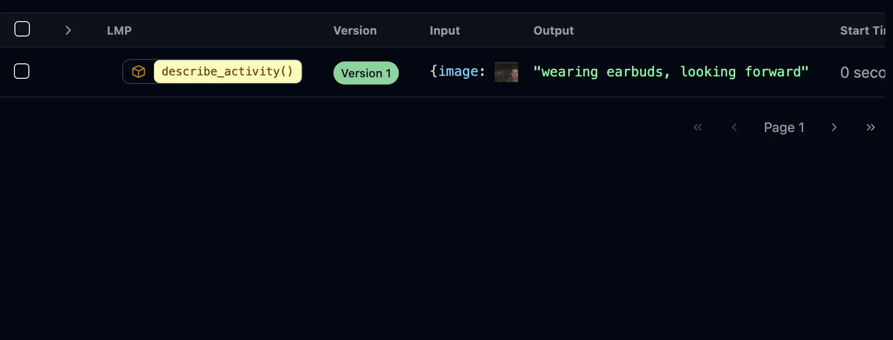

<picture>
  <source media="(prefers-color-scheme: dark)" srcset="docs/src/_static/ell-wide-dark.png">
  <source media="(prefers-color-scheme: light)" srcset="docs/src/_static/ell-wide-light.png">
  
</picture>

--------------------------------------------------------------------------------

[](https://docs.ell.so/) [](https://docs.ell.so/installation) [](https://discord.gg/vWntgU52Xb)  


```bash

pip install -U ell-ai
```

`ell` is a lightweight, functional prompt engineering framework built on a few core principles:

### 1. Prompts are programs, not strings.

Prompts aren't just strings; they are all the code that leads to strings being sent to a language model. In `ell` we think of one particular way of using a language model as a discrete subroutine called a **language model program**.

```python
import ell

@ell.simple(model="gpt-4o")
def hello(world : str):
    """You are a helpful assistant that writes in lower case.""" # System Message
    return f"Say hello to {world[::-1]} with a poem."    # User Message

hello("sama")
```



### 2. Prompts are actually parameters of a machine learning model.


The process of prompt engineering involves many iterations, similar to the optimization processes in machine learning. Because LMPs are just functions, `ell` provides rich tooling for this process.




`ell` provides **automatic versioning and serialization of prompts** through static and dynamic analysis and  `gpt-4o-mini` **autogenerated commit messages** directly to a *local store*. This process is similar to `checkpointing` in a machine learning training loop, but it doesn't require any special IDE or editor - it's all done with regular Python code.

### 3. Tools for monitoring, versioning, and visualization

Prompt engineering goes from a dark art to a science with the right tools. **Ell Studio is a local, open source tool for prompt version control, monitoring, visualization**. With Ell Studio you can empiricize your prompt optimization process over time and catch regressions before it's too late.


```bash
ell-studio --storage ./logdir 
```


### 4. Multimodality should be first class

LLMs can process and generate various types of content, including text, images, audio, and video. Prompt engineering with these data types should be as easy as it is with text.

```python
from PIL import Image
import ell


@ell.simple(model="gpt-4o", temperature=0.1)
def describe_activity(image: Image.Image):
    return [
        ell.system("You are VisionGPT. Answer <5 words all lower case."),
        ell.user(["Describe what the person in the image is doing:", image])
    ]

# Capture an image from the webcam
describe_activity(capture_webcam_image()) # "they are holding a book"
```


`ell` supports rich type coercion for multimodal inputs and outputs. You can use PIL images, audio, and other multimodal inputs inline in `Message` objects returned by LMPs.

### ...and much more!

Read more in the [docs](https://docs.ell.so/)!

## Installation
To install `ell` and `ell studio`, you can use pip. Follow these steps:

1. Open your terminal or command prompt.
2. Run the following command to install the `ell-ai` package from PyPI:

   ```bash
   pip install ell-ai
   ```

3. Verify the installation by checking the version of `ell`:

   ```bash
   python -c "import ell; print(ell.__version__)"
   ```

This will install both `ell` and `ell studio` on your system, allowing you to start using the tools for prompt engineering and visualization.


## Next Steps

Explore the [documentation](https://docs.ell.so/) to learn more about `ell` and its features. Follow the [Getting Started guide](https://docs.ell.so/getting_started.html) to create your first Language Model Program. Join our [Discord community](https://discord.gg/vWntgU52Xb) to connect with other users and get support.