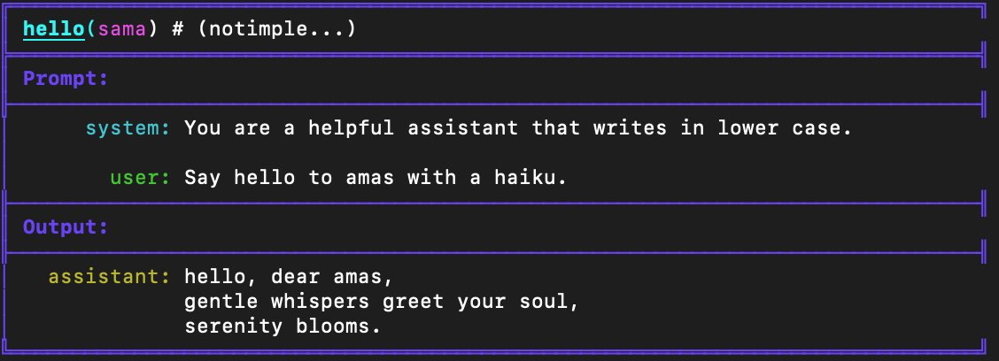

#  `ell` [WIP, unreleased, experimental] 
[](https://discord.gg/J2UhksbE)
[](https://discord.gg/J2UhksbE)
[](https://discord.gg/J2UhksbE)
[](https://discord.gg/J2UhksbE)

> **IMPORTANT**: This repository is currently pre-v1.0, highly experimental, and not yet packaged for general use. It contains numerous bugs, and the schemas are subject to frequent changes. While we welcome contributions, please be aware that submitting pull requests at this stage is at your own discretion, as the codebase is rapidly evolving.

> **[JOIN THE DISCORD](https://discord.gg/J2UhksbE)** We are developing this in public and I want all hands on deck regarding design decisions! Join us at [https://discord.gg/J2UhksbE](https://discord.gg/J2UhksbE)

# What is `ell`?

 `ell` is a lightweight, functional prompt engineering framework built on a few core principles:
### 1. Prompts are programs not strings.
Prompts aren't just strings; they are all the code that leads to strings being sent to a language model. In `ell` we think of one particular way of using a language model as a discrete subroutine called a **language model program**. 


```python
import ell

@ell.lm(model="gpt-4o")
def hello(world : str):
    """You are a helpful assistant that writes in lower case.""" # System Message
    return f"Say hello to {world[::-1]} with a poem."    # User Message

hello("sama")
```


### 2. Prompts are actually parameters of a machine learning model.

- [ ] Add notes on serialization and lexical closures
...

### 3. Every call to a language model is worth its weight in credits.

...

## Installation

To install `ell`, follow these steps:

1. Clone the repository:
   ```
   git clone https://github.com/MadcowD/ell.git
   ```

2. Navigate to the cloned directory:
   ```
   cd ell
   ```

3. Install the package using pip:
   ```
   pip install .
   ```

This will install `ell` and its dependencies, including building the necessary frontend components for `ell-studio`. 

Note: Ensure you have Node.js and npm installed on your system, as they are required for building the frontend components during the installation process.


## Using `ell-studio`

To visaulize and track your promtps over the course of prompt engineering you need to install a store into your project. 

```python 

# The entry point to your program
if __name__ == "__main__":

    store = SQLiteStore('sqlite_example') # <---- automatically stores all LMP's invocations, and version history in a sqlite database in ./sqlite_example
    store.install(autocommit=True) # <---- installs the store into your project so that tracking happens and change log commit messages are automatically generated using gpt-4o-mini

    your_language_model_program()
    print(greeting[::-1])

``` 

Now you can visualize your prompt engineering process just like tensorboard by using `ell.studio`:

```
python3 -m ell.studio --storage-dir ./sqlite_example 
```

Then visit `http://localhost:8000` in your browser to see your prompt engineering process visualized.


## Contributing

To contribute, install `ell` in development mode using:

```
pip install -e .
```

To run `ell-studio` you must seperately run the backend and the front-end. To start the front-end:
```
cd ell-studio
npm run dev
```
To start the backend: 
```
python -m ell.studio --storage-dir ./sqlite_example --dev # the dev flag is important!
```
You can then visualize your promtps by visiting the frontend on `http://localhost:3000`

## Todos


### Metrics

- [ ] Design the metrics functionality. (maybe link WandB lol)

### Bugs

- [ ] Fix weird rehashing issue of the main prompt whenever subprompt changes? Or just make commits more of a background deal.
- [ ] Trace not writing on first invoc.
- [ ] Rewrite lexical closures
- [ ] Serialize lkstrs in the jkson dumps in pyhton the same way as the db serializers them for the frontend (__lstr vs SerialziedLstr) <- these are pydantic models and so we can reuse them
- [ ] handle failure to serialize.

## Tests
- [ ] Add comprehensive unit tests for all core functionalities.
- [ ] Implement integration tests for end-to-end workflows.
- [ ] Optimize backend performance and run benchmarks.

## Trace Functionality
- [x] Visualize trace in graph
- [x] Implement Langsmith-style invocations and traces
- [x] Improve UX on traces
- [o] Complete full trace implementation on invocation page
- [x] Enhance UX around traces in dependency graphs
- [o] Implement argument pass-through functionality

## Version History
- [x] Auto-document commit changes
- [x] Implement version history diff view (possibly with automatic commit messages using GPT-4)
- [ ] Add interactive diff view
- [ ] Highlight changes in source when switching versions

## LM Functionality
- [ ] Support multimodal inputs
- [ ] Implement function calling
- [ ] Add persistent chatting capability
- [ ] Integrate with various LLM providers

## Use Cases
- [ ] Develop RAG (Retrieval-Augmented Generation) example
- [ ] Implement embeddings functionality
- [ ] Create examples for tool use and agents
- [ ] Demonstrate Chain of Thought (CoT) reasoning
- [ ] Showcase optimization techniques

## Store
- [ ] Improve developer experience around logging mechanisms
- [ ] Drastically improve query runtime and performance test.

## DX (Developer Experience)
- [x] Enhance UX for the LMP details page
- [ ] Add Dependency Graph on LMP page
- [ ] Implement VSCode-style file explorer
- [ ] Ensure and test Jupyter compatibility
- [ ] Continue UI/UX improvements for the visualization component
- [x] Update LMP Details to be function-based for easier result viewing
- [ ] Implement easy navigation similar to VSCode (cmd+shift+p or spotlight)
- [x] Optimize display of dependencies on prompt pages
- [ ] Explore alternative backend options
- [ ] Automatic API key management if not specified as a nice experience. Should ask for the api key and store it in the ~/.ell/api_keys directory for the user's convenience.
- [ ] Need a cli for managing api keys etc


## Packaging
- [ ] Write comprehensive documentation
- [x] Prepare package for distribution
- [ ] Refine and organize examples
- [x] Create production build for ell studio
- [ ] Draft contribution guidelines

## Miscellaneous
- [ ] Implement metric tracking system
- [ ] Add built-ins for classifiers (e.g., logit debiasing)
- [ ] Develop evaluator framework
- [ ] Create timeline visualization
- [ ] Implement comment system
- [ ] Add easy-to-use human evaluation tools
- [ ] Implement keyboard shortcuts for navigating invocations
- [ ] Ensure all components are linkable
- [ ] Add comparison mode for language models and double-blind setup for evaluations
- [ ] Integrate AI-assisted evaluations and metrics
- [ ] Consider developing as a VSCode plugin
- [ ] Implement organization system for multiple prompts (e.g., by module)
- [ ] Add live updates and new content indicators

- [x] Update stores to use schema type hints and serialize to model dump in Flask (or consider switching to FastAPI)