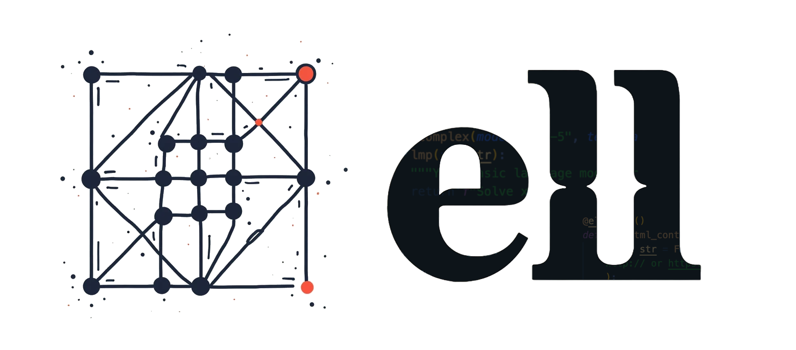
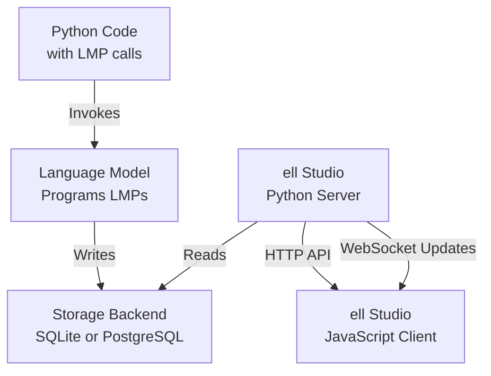

--------------------------------------------------------------------------------

[](https://discord.gg/vWntgU52Xb)
[](https://discord.gg/vWntgU52Xb)
[](https://discord.gg/vWntgU52Xb)
[](https://discord.gg/vWntgU52Xb)

> **IMPORTANT**: This repository is currently pre-v1.0, highly experimental, and not yet packaged for general use. It contains numerous bugs, and the schemas are subject to frequent changes. While we welcome contributions, please be aware that submitting pull requests at this stage is at your own discretion, as the codebase is rapidly evolving.

> **[JOIN THE DISCORD](https://discord.gg/vWntgU52Xb)** We are developing this in public and want all hands on deck regarding design decisions! Join us at [https://discord.gg/vWntgU52Xb](https://discord.gg/vWntgU52Xb)

# What is `ell`?

`ell` is a lightweight, functional prompt engineering framework built on a few core principles:

### 1. Prompts are programs, not strings.

Prompts aren't just strings; they are all the code that leads to strings being sent to a language model. In `ell` we think of one particular way of using a language model as a discrete subroutine called a **language model program**.

```python
import ell

@ell.lm(model="gpt-4o")
def hello(world : str):
    """You are a helpful assistant that writes in lower case.""" # System Message
    return f"Say hello to {world[::-1]} with a poem."    # User Message

hello("sama")
```


### 2. Prompts are actually parameters of a machine learning model.

- [ ] Add notes on serialization and lexical closures
      ...

### 3. Every call to a language model is worth its weight in credits.

...

## Installation

To install `ell`, follow these steps:

1. Clone the repository:

   ```
   git clone https://github.com/MadcowD/ell.git
   ```

2. Navigate to the cloned directory:

   ```
   cd ell
   ```

3. Install the package using pip:
   ```sh
   poetry install
   poetry run build-hook
   ```

This will install `ell` and its dependencies, including building the necessary frontend components for `ell-studio`.

Note: Ensure you have Node.js and npm installed on your system, as they are required for building the frontend components during the installation process.

## Using `ell-studio`

To visaulize and track your promtps over the course of prompt engineering you need to install a store into your project.

```python

# The entry point to your program
if __name__ == "__main__":

    store = './logdir' # <---- automatically stores all LMP's invocations, and version history in a sqlite database in ./logdir
    store.install(autocommit=True) # <---- installs the store into your project so that tracking happens and change log commit messages are automatically generated using gpt-4o-mini

    your_language_model_program()
    print(greeting[::-1])

```

Now you can visualize your prompt engineering process just like tensorboard by using `ell.studio`:

```
python3 -m ell.studio --storage-dir ./logdir
```

Then visit `http://localhost:8000` in your browser to see your prompt engineering process visualized.

## Contributing

To contribute, install `ell` in development mode using:

```
poetry install
poetry shell
```

To run `ell-studio` you must seperately run the backend and the front-end. To start the front-end:

```
cd ell-studio
npm run dev
npm run start:dev
```

To start the backend:

```
python -m ell.studio --storage-dir ./logdir --dev # the dev flag is important!
```

You can then visualize your promtps by visiting the frontend on `http://localhost:3000`


## v1 release todos
- LMP UX Finished entirely
- Postgres backend
- Clean all of the pydantic schema serialziation santiziation etc that we do throughout the codebase
- Full version history UX
- Package on pypy
- Docs 
- Jupyter compatability
- Tests
- Convert all of our todos into issues and milestones
- Multimodality
- Output parsing.

## Architecture v0

