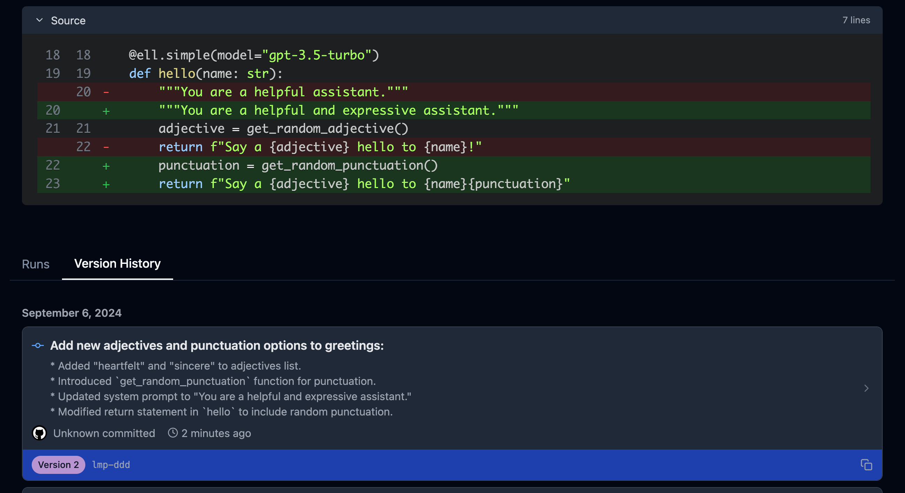
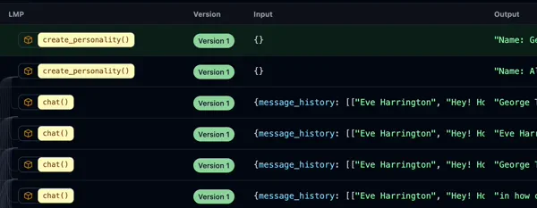

=================================================
Versioning & Tracing
=================================================

Prompt Engineering is the process of rapidly iterating on the set of system, user, and pre-packaged assistant messages sent to a language model. The goal is to maximize some explicit or implied objective function. In an ideal scientific scenario, we would have reward models or metrics that could automatically assess the quality of prompts. One would simply modify the text or formatting of the sent messages to maximize this objective.

However, the reality of this process is much messier. Often, a prompt engineer will work on a few examples for the language model program they're trying to develop, tweaking the prompt slightly over time, testing and hoping that the resulting outputs seem better in practice. This process comes with several issues:

1. It's often unclear if a change in a prompt will uniformly improve the quality of a language model program.
2. Sometimes regressions are introduced, unknown to the prompt engineer, due to dependencies elsewhere in the codebase.
3. The process of testing different hypotheses and then reverting those tests often involves using the undo/redo shortcuts in the editor of choice, which is not ideal for tracking changes.

Checkpointing prompts
----------------------

A solution to this problem can be found by drawing analogies to the training process in machine learning. Prompt engineering, in essence, is a form of parameter search. We modify a model over time with local updates, aiming to maximize or minimize some global objective function.

In machine learning, this process is known as the training loop. Each instance of the model's parameters is called a checkpoint. These checkpoints are periodically saved and evaluated for quality. If a hyperparameter change leads to a failure in the training process, practitioners can quickly revert to a previous checkpoint, much like version control in software engineering.

However, versioning or checkpointing prompts during the prompt engineering process is cumbersome with standard language model API calls or current frameworks. Prompt engineers often resort to inefficient methods:

- Checking in prompt code to version control systems like git for every minor change during the iterative prompt engineering process
- Storing commit hashes alongside outputs for comparison
- Saving prompts and outputs to text files

These approaches are highly cumbersome and go against typical version control workflows in software development. Some prompt engineering frameworks offer versioning, but they often require the use of pre-built IDEs or specific naming conventions. This approach doesn't align well with real-world LLM applications, where calls are often scattered throughout a codebase.

A key feature of ``ell`` is its behind-the-scenes version control system for language model programs. This system allows for comparison, visualization, and storage of prompts as the codebase evolves, both in production and development settings. Importantly, it requires no changes to the prompt engineer's workflow.

Serializing prompts via lexical closures
~~~~~~~~~~~~~~~~~~~~~~~~~~~~~~~~~~~~~~~~~

This automatic versioning is possible because ell treats prompts as discrete functional units called language model programs. By encapsulating the prompt within a function, we can use static and dynamic analysis tools to extract the source code of a prompt program and all its lexical dependencies at any point in time. This approach captures the exact set of source code needed to reproduce the prompt.

Consider the following function embedded in a large code base.

.. code-block:: python

    from myother_module import CONSTANT
    def other_code():
        print("hello")

    def some_other_function():
        return "to bob"

    @ell.simple(model="gpt-4o")
    def hi():
        """You are a helpful assistant"""
        return f"say hi {some_other_function()} {CONSTANT} times."

    def some_other_code():
        return "some other code"

What does it mean to serialize and version the LMP `hi` above? A first approach might be to simply capture the source code of the function body and its signature. 

.. code-block:: python

    @ell.simple(model="gpt-4o")
    def hi():
        """You are a helpful assistant"""
        return f"say hi {some_other_function()} {CONSTANT} times."

However, this approach isn't quite sufficient. If the dependency `some_other_function` changes, the language model program `hi` has fundamentally changed as well. Consequently, all the outputs you expect to see when calling it would also change. Fortunately, the solution is to compute the lexical closure. The lexical closure of a function is essentially its source code along with the source of every global and free variable that it depends on. For example:

.. code-block:: python

    >>> lexical_closure(hi) 
    '''
    CONSTANT = 6

    def some_other_function():
        return "to bob"

    @ell.simple(model="gpt-4o")
    def hi():
        """You are a helpful assistant"""
        return f"say hi {some_other_function()} {CONSTANT} times."
    '''

Full closure can be computed through static analysis by inspecting the Abstract Syntax Tree (AST) of the function and all of its bound globals. This process recursively enumerates dependencies to compute a minimal set of source code that would enable you to reproduce the function. For brevity, we can ignore system and user libraries that were installed by package managers, as these are typically considered part of the execution environment rather than the function's specific closure.

Constructing a dependency graph
~~~~~~~~~~~~~~~~~~~~~~~~~~~~~~~~

In addition, when a language model program depends on another prompt (i.e., when one language model program calls another), the dependent prompt will automatically appear within the lexical closure of the calling prompt. This allows us to construct a computation graph that illustrates how language model programs depend on one another to execute, effectively leveraging test-time compute. This graph provides a clear visualization of the relationships and dependencies between different prompts in a complex language model program.

.. image:: ../_static/compositionality.webp
   :alt: ell demonstration
   :class: rounded-image invertible-image
   :width: 100%

.. code-block:: python
    
    import ell
    from typing import List

    @ell.simple(model="gpt-4o-mini", temperature=1.0)
    def generate_story_ideas(about : str):
        """You are an expert story ideator. Only answer in a single sentence."""
        return f"Generate a story idea about {about}."

    @ell.simple(model="gpt-4o-mini", temperature=1.0)
    def write_a_draft_of_a_story(idea : str):
        """You are an adept story writer. The story should only be 3 paragraphs."""
        return f"Write a story about {idea}."

    @ell.simple(model="gpt-4o", temperature=0.1)
    def choose_the_best_draft(drafts : List[str]):
        """You are an expert fiction editor."""
        return f"Choose the best draft from the following list: {'\n'.join(drafts)}."

    @ell.simple(model="gpt-4-turbo", temperature=0.2)
    def write_a_really_good_story(about : str):
        """You are an expert novelist that writes in the style of Hemmingway. You write in lowercase."""
        # Note: You can pass in api_params to control the language model call
        # in the case n = 4 tells OpenAI to generate a batch of 4 outputs.
        ideas = generate_story_ideas(about, api_params=(dict(n=4))) 

        drafts = [write_a_draft_of_a_story(idea) for idea in ideas]

        best_draft = choose_the_best_draft(drafts)

        
        return f"Make a final revision of this story in your voice: {best_draft}."

    story = write_a_really_good_story("a dog")

Versioning
----------

With the ability to checkpoint and serialize prompts, we can now facilitate a key promise of a useful prompt engineering library: automatic versioning.

Prompt versioning comes in two flavors: automatic versioning during the prompt engineering process, and archival versioning in storage during production deployments. The former is important for the reasons previously mentioned; as a prompt engineer changes and tunes the prompt over time, they may often revert to previous versions or need to compare across them. The latter is crucial for debugging and regression checks of production deployments, as well as the creation of large-scale fine-tuning and comparison datasets. ell is designed with both of these in mind.

In designing ell, it was essential that this versioning system happened entirely behind the scenes and did not dictate any specific way in which the prompt engineer needs to facilitate their own process. Therefore, to enable automatic versioning, one simply passes in a storage parameter to the initialization function of ell, where various settings are configured:

.. code-block:: python

    ell.init(store='./logdir')

The argument ``store`` points to either a local path to store data or an ``ell.storage.Store`` object. An ell store is an interface for storing prompts and their invocations, i.e., the input and outputs of a language model program as well as the language model called, generated, and any other metadata. By default, when a path is specified, ell uses a local SQLite DB and an expandable file-based blob store for larger language model programs or invocations that cannot effectively fit into rows of the database.

.. note::
    For production use, ell can utilize a store in any arbitrary database. In the near future, ell will be launching a service similar to Weights & Biases (wandb), where your team can store all prompts in a centralized prompt version control system. This will provide collaborative features and advanced versioning capabilities, much like what wandb offers for machine learning experiments.

When ell is initialized with a store of any kind, anytime a language model program is invoked (actually, the first time it's invoked), the lexical closure of source of that language model program is computed and hashed to create a version hash for that language model program. In addition, the aforementioned dependency graph is computed, and this language model program is then written to the store. After the invocation occurs, all of the input and output data associated with that version of the language model program is also stored in the database for later analysis. As the prompt engineering process continues, new versions of the language model programs are only added to the store if they are invoked at least once.

.. code-block:: python

    import ell
    from ell.stores.sql import SQLiteStore

    ell.init(store='./logdir', autocommit=True)

    @ell.simple(model="gpt-4o-mini")
    def greet(name: str):
        """You are a friendly greeter."""
        return f"Generate a greeting for {name}."

    result = greet("Alice")
    print(result)  # Output: "Hello, Alice! It's wonderful to meet you."

After this execution, a row might be added to the `SerializedLMP` table:

.. code-block:: text

    lmp_id: "1a2b3c4d5e6f7g8h"
    name: "greet"
    source: "@ell.simple(model=\"gpt-4o-mini\")\ndef greet(name: str):\n    \"\"\"You are a friendly greeter.\"\"\"\n    return f\"Generate a greeting for {name}.\""
    dependencies: ""
    created_at: "2023-07-15T10:30:00Z"
    lmp_type: "LM"
    api_params: {"model": "gpt-4o-mini"}
    initial_free_vars: {}
    initial_global_vars: {}
    num_invocations: 1
    commit_message: "Initial version of greet function"
    version_number: 1

And a corresponding row in the `Invocation` table:

.. code-block:: text

    id: "9i8u7y6t5r4e3w2q"
    lmp_id: "1a2b3c4d5e6f7g8h"
    latency_ms: 250.5
    prompt_tokens: 15
    completion_tokens: 10
    created_at: "2023-07-15T10:30:01Z"

With its associated `InvocationContents`:

.. code-block:: text

    invocation_id: "9i8u7y6t5r4e3w2q"
    params: {"name": "Alice"}
    results: ["Hello, Alice! It's wonderful to meet you."]
    invocation_api_params: {"temperature": 1.0, "max_tokens": 50}

This structure allows for efficient tracking and analysis of LMP usage and performance over time.

Autocommitting
~~~~~~~~~~~~~~

Because prompts are just their source code and versions and diffs between versions are automatically computed in the background, we can additionally automatically create human-readable commit messages between versions:

.. code-block:: python

    ell.init(store='./logdir', autocommit=True)

By providing the autocommit=True argument to the initialization function for ell, every time a version is created that supersedes a previous version of a prompt (as collocated by their fully qualified name), ell will use GPT-4-mini to automatically generate a human-readable commit message that can then be viewed later to show effective changes across versions. This works both for the local automatic prompt versioning during prompt engineering to quickly locate an ideal prompt or previous prompt that was developed, and for archival prompt versioning in production when seeking out regressions or previously differently performing language model programs.

Tracing
-------

Central to the prompt engineering process is understanding not just how prompts change, but how they are used.

Traditionally, without a dedicated prompt engineering framework, developers resort to manually storing inputs and outputs from language model API providers. This approach typically involves intercepting API calls and constructing custom database schemas for production applications. However, this method often proves cumbersome, lacking scalability across projects and necessitating frequent re-implementation.

To address these challenges, solutions like Weave and LangChain/LangSmith have emerged, each offering distinct approaches:

1. Function-level tracing: This method captures inputs and outputs of arbitrary Python functions. While effective for monitoring production deployments, it falls short in tracking intra-version changes that often occur during local development and prompt engineering iterations.

2. Framework-specific versioning: This approach, exemplified by LangChain, requires prompts to be versioned within a specific framework. Prompts are typically compressed into template strings or combinations of template strings and versioned Python code. While structured, this method can be restrictive and may not suit all development workflows.

ell takes the best of both worlds by serializing arbitrary Python code. This allows us to track how language model programs are used through their inputs and outputs, organizing these uses by version for later comparison. Importantly, this is achieved without requiring users to do anything more than write normal Python code to produce their prompt strings for the language model API.

Constructing a computation graph
~~~~~~~~~~~~~~~~~~~~~~~~~~~~~~~~

When using the ell store, all inputs and outputs of language model programs are stored. But what about interactions between them?

To track how language model programs interact during execution and construct a computation graph of data flow (similar to deep learning frameworks like PyTorch and TensorFlow), ell wraps the outputs of all language model programs with a tracing object.

Tracing objects are wrappers around immutable base types in Python. They keep track of originating language model programs and other metadata, preserving this trace of origination across arbitrary operations. One of the most important tracing objects is the _lstr object.

For example, consider the following language model program:

.. code-block:: python

    import ell

    @ell.simple(model="gpt-4o") # version: ae8f32s664200e1
    def hi():
        return "say hi"

    x = hi() # invocation id: 4hdfjhe8ehf (version: ae8f32s664200e1)

While x in this example is functionally a string and behaves exactly like one, it is actually an _lstr:

.. code-block:: python

    >>> type(x)
    <class 'ell.types._lstr.lstr'>

    >>> x
    'hi'

    >>> x.__origin_trace__ 
    {'4hdfjhe8ehf'}

Furthermore, continued manipulation of the string preserves its origin trace, as all original string operations are overridden to produce new immutable instances that contain or combine origin traces.

.. code-block:: python

    >>> x[0]
    'h'

    >>> x[0].__origin_trace__
    {'4hdfjhe8ehf'}

    >>> x + " there"
    'hi there'

    >>> (x + " there").__origin_trace__
    {'4hdfjhe8ehf'}

Additionally, when two mutable objects are combined, the resulting trace is the union of the two traces.

.. code-block:: python

    >>> x = hi() # invocation id: 4hdfjhe8ehf
    >>> y = hi() # invocation id: 345hef345h
    >>> z = x + y
    >>> z.__origin_trace__
    {'4hdfjhe8ehf', '345hef345h'}

By tracking both inputs and outputs of language model programs, we can use these origin traces to construct a computation graph. This graph illustrates how language model programs interact during execution.

This capability allows you to easily track the flow of language model outputs, identify weak points in prompt chains, understand unintended mutations in inputs and outputs of prompts as they are executed, and more generally, create a path for future symbolic and discrete optimization techniques applied to language model programs.

.. code-block:: python

    @ell.simple(model="gpt-4o-2024-08-06", temperature=1.0)
    def create_personality() -> str:
        """You are backstoryGPT. You come up with a backstory for a character incljuding name. Choose a completely random name from the list. Format as follows.

    Name: <name>
    Backstory: <3 sentence backstory>'""" # System prompt

        return "Come up with a backstory about " + random.choice(names_list) # User prompt

    def format_message_history(message_history : List[Tuple[str, str]]) -> str:
        return "\n".join([f"{name}: {message}" for name, message in message_history])

    @ell.simple(model="gpt-4o-2024-08-06", temperature=0.3, max_tokens=20)
    def chat(message_history : List[Tuple[str, str]], *, personality : str):

            return [
                ell.system(f"""Here is your description.
    {personality}. 

    Your goal is to come up with a response to a chat. Only respond in one sentence (should be like a text message in informality.) Never use Emojis."""),
                ell.user(format_message_history(message_history)),
            ]

.. note::
   Currently, origin tracing in ell works only on string primitives. We're actively developing support for arbitrary object tracking, which will be available in a future release. This enhancement will allow for more comprehensive tracing of various data types throughout your language model programs.

------------------------------------------------

In the next chapter, we will explore how to visualize versioning and tracing data using ell studio. This powerful tool provides a comprehensive interface for analyzing and understanding the complex interactions within your language model programs.