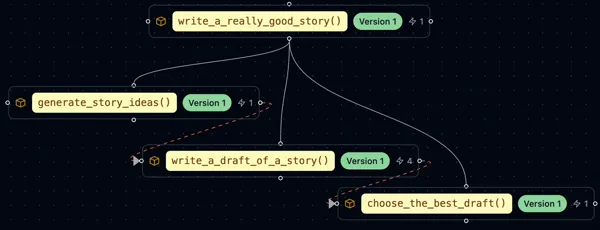

=================================================
Versioning & Visualization
=================================================

Prompt Engineering is the process of rapidly iterating on the set of system, user, and pre-packaged assistant messages sent to a language model. The goal is to maximize some explicit or implied objective function. In an ideal scientific scenario, we would have reward models or metrics that could automatically assess the quality of prompts. One would simply modify the text or formatting of the sent messages to maximize this objective.

However, the reality of this process is much messier. Often, a prompt engineer will work on a few examples for the language model program they're trying to develop, tweaking the prompt slightly over time, testing and hoping that the resulting outputs seem better in practice. This process comes with several issues:

1. It's often unclear if a change in a prompt will uniformly improve the quality of a language model program.
2. Sometimes regressions are introduced, unknown to the prompt engineer, due to dependencies elsewhere in the codebase.
3. The process of testing different hypotheses and then reverting those tests often involves using the undo/redo shortcuts in the editor of choice, which is not ideal for tracking changes.

Checkpointing prompts
----------------------

A solution to this problem can be found by drawing analogies to the training process in machine learning. More specifically, prompt engineering is a form of parameter search where we are modifying a model over time with local updates, hoping that some global objective function is maximized or minimized. In machine learning, this process is often referred to as the training loop. Each instance of the model's parameters is called a checkpoint. As the training process occurs, checkpoints are occasionally saved and evaluated for quality. If a hyperparameter of the training process leads to the failure of the training process, the practitioner can quickly revert to a previous checkpoint, similar to version control in software engineering.

With standard language model API calls or current prompt engineering frameworks, accomplishing versioning or checkpointing of prompts during the prompt engineering process is cumbersome. It either involves the prompt engineer checking in to a standard version control system like git, the code of their prompt at a given iteration, and making sure to store commit hashes alongside all of the outputs the prompt engineer wishes to compare against, or saving their prompts and outputs to text files for later comparison. This is highly cumbersome and an anti-pattern to typical version control workflows in software development. At best, current prompt engineering frameworks allow prompt engineers to version prompts by requiring them to use pre-built IDEs in which prompts need to be stored with specific names or a particular editor must be used to effectuate prompt versioning. This approach is orthogonal to the reality of using LLMs in real-world applications, i.e., these LLM calls are often scattered throughout a codebase, and we need to work in line with existing software infrastructure.

One of the key features of ell is a version control system for language model programs that works automatically behind the scenes. This system enables the comparison, visualization, and storage of prompts as the codebase evolves in both production and development settings, without requiring any changes to the prompt engineer's workflow.

This automatic versioning is possible because in ell, prompts are discrete functional units called language model programs. By encapsulating the prompt within a function, we can use typical static and dynamic analysis tools to extract the source code of a prompt program and all its lexical dependencies at any point in time. This means we can capture the set of source code needed to directly reproduce the prompt.

Serializing prompts via lexical closures
~~~~~~~~~~~~~~~~~~~~~~~~~~~~~~~~~~~~~~~~~

Consider the following function embedded in a large code base.

.. code-block:: python

    from myother_module import CONSTANT
    def other_code():
        print("hello")

    def some_other_function():
        return "to bob"

    @ell.simple(model="gpt-4o")
    def hi():
        """You are a helpful assistant"""
        return f"say hi {some_other_function()} {CONSTANT} times."

    def some_other_code():
        return "some other code"

What does it mean to serialize and version the LMP `hi` above? A first approach might be to simply capture the source code of the function body and its signature. 

.. code-block:: python

    @ell.simple(model="gpt-4o")
    def hi():
        """You are a helpful assistant"""
        return f"say hi {some_other_function()} {CONSTANT} times."

However, this approach isn't quite sufficient. If the dependency `some_other_function` changes, the language model program `hi` has fundamentally changed as well. Consequently, all the outputs you expect to see when calling it would also change. Fortunately, the solution is to compute the lexical closure. The lexical closure of a function is essentially its source code along with the source of every global and free variable that it depends on. For example:

.. code-block:: python

    >>> lexical_closure(hi) 
    '''
    CONSTANT = 6

    def some_other_function():
        return "to bob"

    @ell.simple(model="gpt-4o")
    def hi():
        """You are a helpful assistant"""
        return f"say hi {some_other_function()} {CONSTANT} times."
    '''

Full closure can be computed through static analysis by inspecting the Abstract Syntax Tree (AST) of the function and all of its bound globals. This process recursively enumerates dependencies to compute a minimal set of source code that would enable you to reproduce the function. For brevity, we can ignore system and user libraries that were installed by package managers, as these are typically considered part of the execution environment rather than the function's specific closure.

Constructing a computation graph
~~~~~~~~~~~~~~~~~~~~~~~~~~~~~~~~

In addition, when a language model program depends on another prompt (i.e., when one language model program calls another), the dependent prompt will automatically appear within the lexical closure of the calling prompt. This allows us to construct a computation graph that illustrates how language model programs depend on one another to execute, effectively leveraging test-time compute. This graph provides a clear visualization of the relationships and dependencies between different prompts in a complex language model program.

.. code-block:: python
    
    import ell
    from typing import List

    @ell.simple(model="gpt-4o-mini", temperature=1.0)
    def generate_story_ideas(about : str):
        """You are an expert story ideator. Only answer in a single sentence."""
        return f"Generate a story idea about {about}."

    @ell.simple(model="gpt-4o-mini", temperature=1.0)
    def write_a_draft_of_a_story(idea : str):
        """You are an adept story writer. The story should only be 3 paragraphs."""
        return f"Write a story about {idea}."

    @ell.simple(model="gpt-4o", temperature=0.1)
    def choose_the_best_draft(drafts : List[str]):
        """You are an expert fiction editor."""
        return f"Choose the best draft from the following list: {'\n'.join(drafts)}."

    @ell.simple(model="gpt-4-turbo", temperature=0.2)
    def write_a_really_good_story(about : str):
        """You are an expert novelist that writes in the style of Hemmingway. You write in lowercase."""
        # Note: You can pass in lm_params to control the language model call
        # in the case n = 4 tells OpenAI to generate a batch of 4 outputs.
        ideas = generate_story_ideas(about, lm_params=(dict(n=4))) 

        drafts = [write_a_draft_of_a_story(idea) for idea in ideas]

        best_draft = choose_the_best_draft(drafts)

        
        return f"Make a final revision of this story in your voice: {best_draft}."

    story = write_a_really_good_story("a dog")

Versioning in Ell
-----------------

