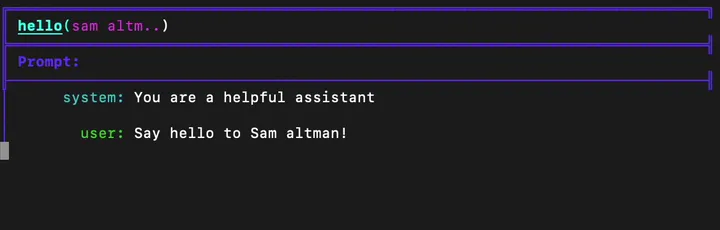

===============
Getting Started
===============

Welcome to ell, the Language Model Programming Library. This guide will walk you through creating your first Language Model Program (LMP), exploring ell's unique features, and leveraging its powerful versioning and visualization capabilities.

From Traditional API Calls to ell
---------------------------------

Let's start by comparing a traditional API call to ell's approach. Here's a simple example using the OpenAI chat completions API:

.. code-block:: python

    import openai

    openai.api_key = "your-api-key-here"

    messages = [
        {"role": "system", "content": "You are a helpful assistant."},
        {"role": "user", "content": "Say hello to Sam Altman!"}
    ]

    response = openai.ChatCompletion.create(
        model="gpt-4o",
        messages=messages
    )

    print(response['choices'][0]['message']['content'])

Now, let's see how we can achieve the same result using ell:

.. code-block:: python

    import ell

    @ell.simple(model="gpt-4o")
    def hello(name: str):
        """You are a helpful assistant."""
        return f"Say hello to {name}!"

    greeting = hello("Sam Altman")
    print(greeting)

In this ell example, we've encapsulated the entire interaction within a function decorated with ``@ell.simple``. The docstring becomes the system message, and the return value becomes the user message.

Understanding ``@ell.simple``
------------------------------

The ``@ell.simple`` decorator is a key concept in ell. It transforms a regular Python function into a **Language Model Program (LMP)**. Here's what's happening:

1. The function's **docstring** becomes the **system message**.
2. The **return value** of the function becomes the **user message**.
3. The decorator **handles the API call** and returns the model's response as a string.

This encapsulation allows for cleaner, more reusable code. You can now call your LMP like any other Python function.

Verbose Mode
------------

To get more insight into what's happening behind the scenes, you can enable verbose mode:

.. code-block:: python

    ell.init(verbose=True)

With verbose mode enabled, you'll see detailed information about the inputs and outputs of your language model calls.

Alternative Message Formats
---------------------------

While the previous example used the docstring for the system message and the return value for the user message, ell offers more flexibility. You can explicitly define messages using ``ell.system``, ``ell.user``, and ``ell.assistant``:

.. code-block:: python

    import ell

    @ell.simple(model="gpt-4o")
    def hello(name: str):
        return [
            ell.system("You are a helpful assistant."),
            ell.user(f"Say hello to {name}!"),
            ell.assistant("Hello! I'd be happy to greet Sam Altman."),
            ell.user("Great! Now do it more enthusiastically.")
        ]

    greeting = hello("Sam Altman")
    print(greeting)

This approach allows you to construct more complex conversations within your LMP. Importantly, you'll want to use this approach when you have a variable system prompt because python only allows you to have a static system prompt.

Prompts as Programs
----------------------------------------

One of ell's most powerful features is its treatment of prompts as programs rather than simple strings. This approach allows you to leverage the full power of Python in your prompt engineering. Let's see how this works:

.. code-block:: python

    import ell
    import random

    def get_random_adjective():
        adjectives = ["enthusiastic", "cheerful", "warm", "friendly"]
        return random.choice(adjectives)

    @ell.simple(model="gpt-4o")
    def hello(name: str):
        """You are a helpful assistant."""
        adjective = get_random_adjective()
        return f"Say a {adjective} hello to {name}!"

    greeting = hello("Sam Altman")
    print(greeting)

In this example, our hello LMP depends on the ``get_random_adjective`` function. Each time ``hello`` is called, it generates a different adjective, creating dynamic, varied prompts.

Storing and Versioning Your Prompts
-----------------------------------

ell provides powerful versioning capabilities for your LMPs. To enable this feature, add the following line near the beginning of your script:

.. code-block:: python

    ell.init(store='./logdir', autocommit=True, verbose=True)

This line sets up a store in the ``./logdir`` directory and enables autocommit. ell will now store all your prompts and their versions in ``./logdir/ell.db``, along with a blob store for images.

Lexical closures
^^^^^^^^^^^^^^^^

When you version a Language Model Program (LMP) like the ``hello`` function above, ell actually stores more than just the function itself. It captures what's called the "lexical closure" of the LMP. This includes all the code necessary to reproduce the LMP, including its dependencies. For example, for the ``hello`` LMP, ell would store:

.. code-block:: python

    import random

    def get_random_adjective():
        adjectives = ["enthusiastic", "cheerful", "warm", "friendly"]
        return random.choice(adjectives)

    @ell.simple(model="gpt-4o")
    def hello(name: str):
        """You are a helpful assistant."""
        adjective = get_random_adjective()
        return f"Say a {adjective} hello to {name}!"

This lexically closured source allows you to keep track of prompts as they change over time, even if those changes happen elsewhere in your codebase. For instance, if you modify the ``get_random_adjective`` function, ell will capture that change as part of the ``hello`` LMP's version history.

This approach has several benefits:

1. **Completeness**: You always have the full context needed to understand and reproduce an LMP.
2. **Flexibility**: Your LMPs can live embedded anywhere in your codebase - in any source file, Jupyter notebook, etc.
3. **Efficiency**: When LMPs are serialized to the ell store, only the minimal set of code they depend on is extracted and stored.

This feature allows for robust versioning and makes it easier to track the evolution of your prompts over time, even as your codebase grows and changes.

Exploring Your Prompts with ell-studio
^^^^^^^^^^^^^^^^^^^^^^^^^^^^^^^^^^^^^^^^

After running your script with versioning enabled, you can explore your prompts using ell-studio. In your terminal, run:

.. code-block:: bash

    ell-studio --storage_dir ./logdir

This command opens the ell-studio interface in your web browser. Here, you can visualize your LMPs, see their dependencies, and track changes over time.

.. image:: _static/ell_studio_better.webp
   :alt: ell demonstration
   :class: rounded-image 
   :width: 100%

Iterating and Auto-Committing
^^^^^^^^^^^^^^^^^^^^^^^^^^^^^^

Let's see how ell's versioning works as we iterate on our ``hello`` LMP:

Version 1:

.. code-block:: python

    import ell
    import random

    ell.init(store='./logdir', autocommit=True)

    def get_random_adjective():
        adjectives = ["enthusiastic", "cheerful", "warm", "friendly"]
        return random.choice(adjectives)

    @ell.simple(model="gpt-4o")
    def hello(name: str):
        """You are a helpful assistant."""
        adjective = get_random_adjective()
        return f"Say a {adjective} hello to {name}!"

    greeting = hello("Sam Altman")
    print(greeting)

After running this script, ell will generate an initial commit message like:

    "Initial version of hello LMP with random adjective selection."

Now, let's modify our LMP:

Version 2:

.. code-block:: python

    import ell
    import random

    ell.init(store='./logdir', autocommit=True)

    def get_random_adjective():
        adjectives = ["enthusiastic", "cheerful", "warm", "friendly", "heartfelt", "sincere"]
        return random.choice(adjectives)

    def get_random_punctuation():
        return random.choice(["!", "!!", "!!!"])

    @ell.simple(model="gpt-4o")
    def hello(name: str):
        """You are a helpful and expressive assistant."""
        adjective = get_random_adjective()
        punctuation = get_random_punctuation()
        return f"Say a {adjective} hello to {name}{punctuation}"

    greeting = hello("Sam Altman")
    print(greeting)

Running this updated script will generate a new commit message:

    "Updated hello LMP: Added more adjectives, introduced random punctuation, and modified system prompt."

ell's autocommit feature uses ``gpt-4o-mini`` to generate these commit messages automatically, providing a clear history of how your LMPs evolve.

.. image:: _static/auto_commit.png
   :alt: ell demonstration
   :class: rounded-image invertible-image
   :width: 100%

Comparing Outputs Across Versions
^^^^^^^^^^^^^^^^^^^^^^^^^^^^^^^^^^^^

One of the powerful features of ell-studio is the ability to compare outputs of your LMPs across different versions. This helps you understand how changes in your code affect the language model's responses.

For example, you can select the two versions of the ``hello`` LMP we created and compare their outputs:

This comparison might show:

Version 1 output: "Here's a warm hello to Sam Altman!"
Version 2 output: "Here's a heartfelt hello to Sam Altman!!!"

By visualizing these differences, you can quickly assess the impact of your changes and make informed decisions about your prompt engineering process.

What's Next?
------------

Now that you've created your first LMP, explored versioning, and learned about ell-studio, there's much more to discover:

- ``@ell.complex``: For advanced use cases involving tool usage, structured outputs, and the full message API.
- Multimodal inputs and outputs: Work with images, videos, and audio in your LMPs.
- API clients and models: Explore various language models and APIs supported by ell.
- Designing effective Language Model Programs: Discover best practices for creating robust and efficient LMPs.
- Tutorials: Check out in-depth tutorials for real-world applications of ell.
