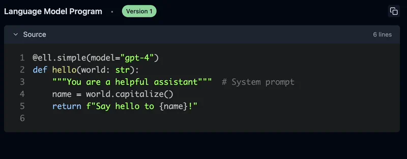

===========================================
ell: The Language Model Programming Library
===========================================

.. raw:: html
   
   

   
   
   
   
   

.. title:: Introduction

``ell`` is a lightweight prompt engineering library treating prompts as functions. After years of building and using language models at OpenAI and in the startup ecosystem, ``ell`` was designed from the following principles:

Prompts are programs, not strings
----------------------------------

.. code-block:: python

    import ell

    @ell.simple(model="gpt-4o-mini")
    def hello(world: str):
        """You are a helpful assistant""" # System prompt
        name = world.capitalize()
        return f"Say hello to {name}!" # User prompt

    hello("sam altman") # just a str, "Hello Sam Altman! ..."

.. image:: _static/gif1.webp
   :alt: ell demonstration
   :class: rounded-image invertible-image
   :width: 100%

Prompts aren't just strings; they are all the code that leads to strings being sent to a language model. In ell, we think of one particular way of using a language model as a discrete subroutine called a **language model program** (LMP).

LMPs are fully encapsulated functions that produce either a string prompt or a list of messages to be sent to various multimodal language models. This encapsulation creates a clean interface for users, who only need to be aware of the required data specified to the LMP.

Prompt engineering is an optimization process
------------------------------------------------

The process of prompt engineering involves many iterations, similar to the optimization processes in machine learning. Because LMPs are just functions, ``ell`` provides rich tooling for this process.

``ell`` provides **automatic versioning and serialization of prompts** through static and dynamic analysis and  ``gpt-4o-mini`` **autogenerated commit messages** directly to a *local store*. This process is similar to `checkpointing` in a machine learning training loop, but it doesn't require any special IDE or editor - it's all done with regular Python code.

.. code-block:: python
   :emphasize-lines: 3,3

    import ell

    ell.init(store='./logdir')  # Versions your LMPs and their calls

    # ... define your lmps

    hello("strawberry") # the source code of the LMP the call is saved to the store
   

Tools for monitoring, versioning, and visualization
-----------------------------------------------------------

.. image:: _static/ell_studio_better.webp
   :alt: ell demonstration
   :class: rounded-image 
   :width: 100%

.. code-block:: bash

   ell-studio --storage ./logdir 

Prompt engineering goes from a dark art to a science with the right tools. **Ell Studio is a local, open source tool for prompt version control, monitoring, visualization**. With Ell Studio you can empiricize your prompt optimziation process over time and catch regressions before its too late. 

Test-time compute is important
--------------------------------

.. Note on how in promtp engineering going from a demo to something that acutally works often requires test time compute (calling a lm many times) techniques like lm critics, bon sampling, reward mdoels, etc and so the LMP abstraction enables extremely readable decomposition of difficult problems in to many calls to language models

Going from a demo to something that actually works, often means prompt engineering solutions that involve multiple calls to a language model.
By forcing a functional decomposition of the problem, ``ell`` makes it **easy to implement test-time compute leveraged techniques in a readable and modular way.**

.. image:: _static/compositionality.webp
   :alt: ell demonstration
   :class: rounded-image invertible-image
   :width: 100%

.. code-block:: python

   import ell
   from typing import List
   
   @ell.simple(model="gpt-4o-mini", temperature=1.0, n=10)
   def write_ten_drafts(idea : str):
      """You are an adept story writer. The story should only be 3 paragraphs"""
      return f"Write a story about {idea}."

   @ell.simple(model="gpt-4o", temperature=0.1)
   def choose_the_best_draft(drafts : List[str]):
      """You are an expert fiction editor."""
      return f"Choose the best draft from the following list: {'\n'.join(drafts)}."

   drafts = write_ten_drafts(idea)

   best_draft = choose_the_best_draft(drafts) # Best of 10 sampling.

   

Every call to a language model is valuable
------------------------------------------------
Every call to a language model is worth its weight in credits. In practice, LLM invocations are used for fine tuning, distillation, k-shot prompting, reinforcement learning from human feedback, and more. A good prompt engineering system should capture these as first class concepts.

.. image:: _static/invocations.webp
   :alt: ell demonstration
   :class: rounded-image invertible-image
   :width: 100%

In addition to storing the source code of every LMP, ``ell`` optionally saves every call to a language model locally. This allows you to generate invocaiton datasets, compare LMP outputs by version, and generally do more with the full spectrum of prompt engineering artifacts.

Complexity when you need it, simplicity when you don't
--------------------------------------------------------

Using language models is **just passing strings around, except when it's not.**

.. code-block:: python
   :emphasize-lines: 7,7

   import ell

   @ell.tool()
   def scrape_website(url : str):
      return requests.get(url).text

   @ell.complex(model="gpt-5-omni", tools=[scrape_website])
   def get_news_story(topic : str):
      return [
         ell.system("""Use the web to find a news story about the topic"""),
         ell.user(f"Find a news story about {topic}.")
      ]

   message_response = get_news_story("stock market") 
   if message_response.tool_calls:
      for tool_call in message_response.tool_calls:
         #...
   if message_response.text:
      print(message_response.text)
   if message_response.audio:
      # message_response.play_audio() supprot for multimodal outputs will work as soon as the LLM supports it
      pass

Using ``@ell.simple`` causes LMPs to yield **simple string outputs.** But when more complex or multimodal output is needed, ``@ell.complex`` can be used to yield ``Message`` objects responses from language mdoels.

Multimodality should be first class
------------------------------------------------

LLMs can process and generate various types of content, including text, images, audio, and video. Prompt engineering with these data types should be as easy as it is with text.

.. code-block:: python
   :emphasize-lines: 1,1, 9,9

   from PIL import Image
   import ell

   @ell.simple(model="gpt-4o", temperature=0.1)
   def describe_activity(image: Image.Image):
      return [
         ell.system("You are VisionGPT. Answer <5 words all lower case."),
         ell.user(["Describe what the person in the image is doing:", image])
      ]

   # Capture an image from the webcam
   describe_activity(capture_webcam_image()) # "they are holding a book"

.. image:: _static/multimodal_compressed.webp
   :alt: ell demonstration
   :class: rounded-image invertible-image
   :width: 100%

``ell`` supports rich type coercion for multimodal inputs and outputs. You can use PIL images, audio, and other multimodal inputs inline in ``Message`` objects returned by LMPs.

Prompt engineering libraries shouldn't interfere with your workflow
--------------------------------------------------------------------

``ell`` is designed to be a lightweight and unobtrusive library. It doesn't require you to change your coding style or use special editors. 

You can continue to use regular Python code in your IDE to define and modify your prompts, while leveraging ell's features to visualize and analyze your prompts. Migrate from langchain to ``ell`` one function at a time.

----------------------------

To get started with ``ell``, see the :doc:`Getting Started <getting_started>` section, or go onto :doc:`Installation <installation>` and get ell installed.

.. toctree::
   :maxdepth: 3
   :caption: The Basics:
   :hidden:

   Introduction <self>
   
   installation
   getting_started

.. toctree::
   :maxdepth: 3
   :caption: Core Concepts:
   :hidden:

   core_concepts/ell_simple
   core_concepts/versioning_and_storage
   core_concepts/ell_studio

   core_concepts/message_api
   core_concepts/ell_complex
   core_concepts/tool_usage
   core_concepts/structured_outputs
   core_concepts/multimodality
   core_concepts/models_and_api_clients
   core_concepts/configuration

   
.. toctree::
   :maxdepth: 1
   :caption: API Reference
   :hidden:

   reference/index
